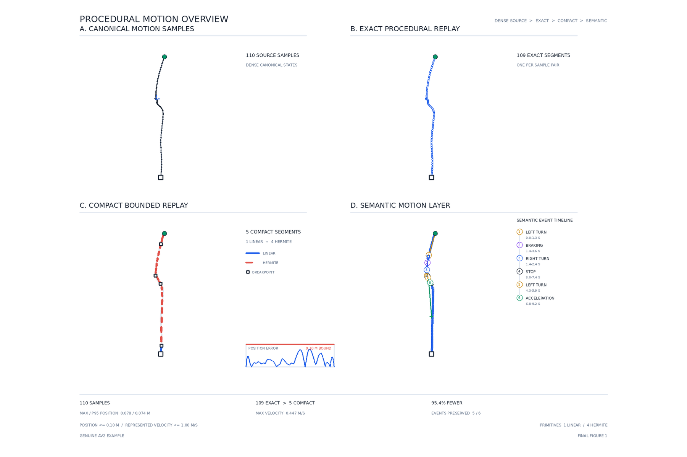

# KinematicWeave

KinematicWeave is a deterministic Python toolkit for representing dynamic 3D
scenes as persistent spatial records plus time-indexed procedural motion. It
includes typed data contracts, exact and error-bounded trajectory codecs,
semantic motion events, shared-motion templates, dataset adapters, and a
reproducible evaluation pipeline.



The project is an early research-software release. Its file formats and Python
APIs may still change, but the checked-in evaluation artifacts are immutable
and independently verifiable.

## Highlights

- Deterministic, versioned records for scenes, agents, trajectories, maps, and
  procedural motion.
- Exact, piecewise-linear, Hermite, and position/velocity-bounded codecs.
- Replay, semantic-event preservation, matched-budget comparisons, ablations,
  and scenario-level statistical analysis.
- Synthetic fixtures that exercise the full core without external data.
- Argoverse 2 adapters that keep provider-specific objects outside the core
  domain model.
- Canonical serialization, content hashes, immutable run directories, and
  provenance manifests.
- CPU-first execution with a locked Python environment and automated checks on
  Linux and Windows.

## Quick start

KinematicWeave supports Python 3.12 and 3.13. Install
[uv](https://docs.astral.sh/uv/), then run from the repository root:

```text
uv sync --frozen
uv run --frozen kinematicweave --version
uv run --frozen kinematicweave doctor
uv run --frozen python scripts/quality.py
```

Run the complete quality gate, including the isolated foundation smoke run,
with:

```text
uv run --frozen python scripts/ci.py
```

Run a small deterministic workflow that needs no external dataset:

```text
uv run --frozen python scripts/run_foundation_smoke.py --run-id example:smoke
```

Generated outputs are written below `results/generated/`, which is ignored by
Git. Run identifiers are caller-provided and completed run directories are
immutable.

## Reproducing the evidence

There are three practical reproduction levels:

1. The smoke workflow validates the environment, schemas, manifests, and
   artifact store using generated data.
2. Lightweight verification checks the committed aggregate evidence without
   downloading the source dataset:

   ```text
   uv run --frozen python scripts/run_phase4_milestone.py --verify-only
   uv run --frozen python scripts/run_layout_feasibility.py --verify-only
   uv run --frozen python scripts/generate_figure1_procedural_overview.py --verify-only
   uv run --frozen python scripts/generate_figure2_and_table1.py --verify-only
   ```

3. Full regeneration uses Argoverse 2 source data and the frozen cohort and
   experiment contracts. See the [reproducibility guide](docs/reproducibility.md)
   and [data guide](docs/data.md) before starting a full run.

Detailed validation records are available for the
[canonical data foundation](docs/phase2_milestone_review.md),
[procedural representation milestone](docs/phase3_milestone_review.md), and
[motion evaluation milestone](docs/phase4_milestone_review.md). The associated
[data runbook](docs/phase2_data_runbook.md),
[representation summary](results/phase3/milestone/summary.md), and
[evaluation summary](results/phase4/milestone/summary.md) provide the compact
machine-verifiable entry points.

The benchmark covers 500 Argoverse 2 motion scenarios: 150 development, 50
pilot, and 300 test scenarios. It evaluates 18 accepted representations under
matched-storage and matched-keyframe comparisons. The evidence supports
method-specific trade-offs; it does not establish a universal winner.

## Repository map

| Path | Purpose |
| --- | --- |
| `src/kinematicweave/` | Typed library and CLI implementation |
| `tests/` | Unit, integration, determinism, and corruption tests |
| `scripts/` | Reproducible workflow entry points |
| `configs/` | Versioned project configuration |
| `definitions/` | Research scope, schemas, metrics, and evaluation contracts |
| `results/` | Selected machine-readable aggregate evidence and manifests |
| `figures/`, `tables/` | Deterministically generated benchmark artifacts |
| `docs/` | Setup, data, reproduction, and troubleshooting guides |

Start with the [architecture overview](docs/architecture.md), then consult the
[motion evaluation runbook](docs/phase4_motion_evaluation_runbook.md) or the
[layout feasibility runbook](docs/phase5_layout_feasibility_runbook.md) for the
complete workflows. The principal frozen evidence is summarized in the
[motion milestone](results/phase4/milestone/summary.md) and
[layout feasibility](results/phase5/layout_feasibility/summary.md) records.

## Scope and limitations

KinematicWeave is research software, not a safety-certified system. The
implemented layout analysis is a descriptive, trajectory-only feasibility
study; it does not reconstruct complete road networks or produce a production
spatial grammar. Numerical replay remains authoritative.

Benchmark results depend on the documented dataset version, cohort manifests,
configuration, and software environment. Performance measurements are
hardware-specific; numerical outputs are checked using the exact or tolerance
rules recorded by each workflow.

## Data, licensing, and attribution

The repository does not redistribute the Argoverse 2 source dataset. The small
adapter fixtures are project-created and contain no external dataset geometry.
Argoverse 2 data is available under CC BY-NC-SA 4.0 and has its own attribution
and use requirements. See [Data and artifact licensing](DATA_LICENSE.md) before
using dataset-derived results, figures, or tables.

Unless a file says otherwise, the source code and project-created documentation
are licensed under Apache-2.0. See [LICENSE](LICENSE) and [NOTICE](NOTICE).

## Contributing and security

Contributions are welcome; see [CONTRIBUTING.md](CONTRIBUTING.md). Please report
security issues through GitHub's private vulnerability reporting rather than a
public issue; see [SECURITY.md](SECURITY.md). Community participation is
governed by the [Code of Conduct](CODE_OF_CONDUCT.md).

For software citation metadata, see [CITATION.cff](CITATION.cff).
